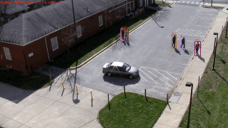

# Retail Vision Analytics

## 1. Project Proposal

Millions of brick-and-mortar stores have cameras; however, most retailers only use their footage for security. Video of your customers is a data treasure trove! So why aren't retailers analyzing their video footage? Because manually reviewing videos is costly and challenging. 

To succeed in a highly competitive marketplace, retailers must know their customers. The capability to produce customer analytics would help businesses better serve their customers and gain an edge over the competition.

The primary questions that I seek to answer are:

* Can useful retail vision analytics be generated from video using object detection and tracking in Computer Vision?
* How reliable and costly is an automated process?

Retail Vision Analytics for retail wasn't feasible ten years ago, but it may be possible today. 

## 2. Data Collection

The primary video data used was the Ground VIRAT Video Dataset Release 2.0. This publicly available video is similar to footage that a retailer would have of customers walking in parking lots and walking areas outside of its stores. The camera views are from various fixed locations, outdoors and during daylight hours. 

## 3. Data Wrangling

The VIRAT videos include annotations for known objects in each frame. I planned to use these annotations as the ground truth for measuring the performance of my model and fine-tuning the pre-trained models. 

However, I discovered discrepancies while visually reviewing the annotation data. Consequentially, I manually annotated one of the VIRAT videos using Roboflow. These annotations will be ground truth and be the basis for the formal evaluation metrics. Due to time and resource limitations for annotating the video, a manual visual review assess the model's results on the remainder of the video footage.

## 4. Models

Our prototype app must do the following:

* Detect and locate persons in the video
* Assign each detected person a unique id and track them through the video
* Generate analytics 

## 4.1 DeepSORT with YOLOv7

My first solution was to use DeepSORT for tracking and run You-Only-Look-Once v7 (YOLOv7) for detection. DeepSORT extends the SORT (Simple Online and Realtime Tracking) to integrate appearance information based on a deep appearance descriptor. YOLOv7 is a state-of-the-art object detection algorithm that uses a convolutional neural network (CNN) trained on the MS COCO dataset. 

Unfortunately, DeepSORT had too many ID switches and frequently performed poorly with occlusions involving groups of people. Performance assessment by a visual review was unacceptable.

## 4.2 ByteTrack with YOLOX

My second attempt was to run ByteTrack and YOLOX. ByteTrack uses an association method that does not discard low-score boxes and employs tracklets to recover actual objects and filter out background detections. The ByteTrack repository comes pre-trained model and uses YOLOX for detection.

ByteTrack had extremely few ID switches in the test video despite numerous occlusions and shady regions. This algorithm's performance was acceptable and made few errors. 

### Results on MOT challenge test set using TrackEval
| Dataset    |  MOTA | IDF1 | HOTA | MT | ML | FP | FN | IDs | FPS |
|------------|-------|------|------|-------|-------|------|------|------|------|
|VIRATS2     | 97.8 | 91.9 | 73.1 |   3   |   0   |   26  |   37  |   3  | 29.97|

### Visualization results on MOT challenge test set
   
   

## 5. The Prototype

The product is a Flask web app running on an Ubuntu 20.04 server in the Paperspace Cloud using a Core machine with a Quadro M4000 and 8 CPUs. 

The app presents a form for users to upload a video. After upload, the application generates analytics and annotates the video using ByteTrack with YOLOX. Finally, a results page allows users to view or download the generated data. 

This product uses Git, a version control system, to manage and track changes to source code. I also included a docker file for easy deployment of the app on multiple systems.

## 6. Conclusions

This project demonstrates that an automated process to analyze videos can be reliable. The metrics and visual inspections revealed that the tracking achieves human-level performance. Additionally, the algorithm is not subject to mental fatigue and better tracks many people than humans. The algorithm occasionally errors during complex occlusions or nearing objects that mimic humans.

The cloud costs to analyze one hour of video are approximately $1.25, assuming a processing speed of $0.50 per hour on a Quadro M4000 that process 2.5 FPS. Processing 12 hours of footage would cost $15 per day and is well within the budget of small retailers.

Important analytics can be readily and cost effectively generated from the tracking data. For example, how long do customers spend in some regions of the store, which products they are most interested in, and even how they interact with products. Retailers can use this information to optimize store layouts, create targeted marketing campaigns, and improve the shopping experience.
