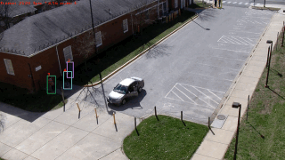
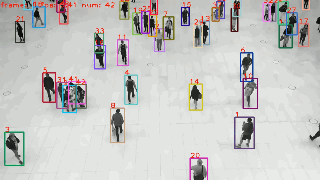
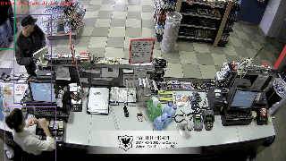
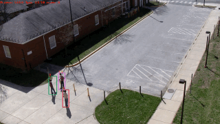

# Retail Vision Analytics

## Tracking Performance

### Results on VIRAT videos, evaluated using TrackEval
| Dataset           |  MOTA | IDF1 | HOTA | MT | ML | FP | FN | IDs |VISUAL|
|-------------------|-------|------|------|-------|-------|------|------|------|------|
|DeepSORT+YOLO7     | 80.4 | 52.4 | 43.4 |   3   |   0   |  240  |  294  |  54  |FAIL |
|ByteTrack+YOLOX    | 97.8 | 91.9 | 73.1 |   3   |   0   |   26  |   37  |   3  |PASS |


### Visualization Results (ByteTrack + YOLOX)
   
   

## Installation
Run the below commands and then open your web browser @ x.x.x.x:5000
```shell
git clone https://github.com/dberwang/retail-vision-analytics
cd retail-vision-analytics
docker build -t retail-vision-analytics:latest .
docker run --gpus all -it --rm --privileged -p 5000:5000 retail-vision-analytics:latest
flask run -h 0.0.0.0
```


## 1. Project Proposal

Millions of brick-and-mortar stores have cameras; however, most retailers only use their footage for security. Video of your customers is a data treasure trove! So why aren't retailers analyzing their video footage? Because manually reviewing videos is costly and challenging. 

To succeed in a highly competitive marketplace, retailers must know their customers. The capability to produce customer analytics would help businesses better serve their customers and gain an edge over the competition.

The primary questions that I seek to answer are:

* Can retail vision analytics be generated from video using Computer Vision? 
* Would generated analytics be reliable?
* How much would an automated process cost?

Retail Vision Analytics for retail wasn't feasible ten years ago, but it may be possible today. 

## 2. Data

The primary video data used was the Ground VIRAT Video Dataset Release 2.0. This publicly available video is similar to footage that a retailer would have of customers walking in parking lots and walking areas outside of its stores. The camera views are from various fixed locations, outdoors and during daylight hours.

The VIRAT videos include annotations for known objects in each frame. I planned to use these annotations to fine-tune the pre-trained models and evaluate performance. The format of the VIRAT annotations differed from YOLO and required converting before generating IOU metrics. Also, I discovered discrepancies while visually reviewing the annotation data that included some sloppy fits and missing detections. Consequentially, I manually annotated one of the VIRAT videos using Roboflow to establish ground truth for evaluating the model. Due to time and resource limitations for annotating the video, a manual visual review assessed the model's results of an unannotated video.

## 3. Models

Our prototype app must do the following:

* Detect and locate persons in the video
* Assign each detected person a unique id and track them through the video
* Generate analytics 

## 3.1 DeepSORT with YOLOv7

My first solution was to use DeepSORT for tracking and run You-Only-Look-Once v7 (YOLOv7) for detection. DeepSORT extends the SORT (Simple Online and Realtime Tracking) to integrate appearance information based on a deep appearance descriptor. YOLOv7 is a state-of-the-art object detection algorithm that uses a convolutional neural network (CNN) trained on the MS COCO dataset. 

Unfortunately, DeepSORT had too many ID switches and frequently performed poorly with occlusions involving groups of people. 

## 3.2 ByteTrack with YOLOX

My second attempt was to run ByteTrack and YOLOX. ByteTrack uses an association method that does not discard low-score boxes and employs tracklets to recover actual objects and filter out background detections. The ByteTrack repository comes pre-trained model and uses YOLOX for detection.

ByteTrack had extremely few ID switches in the test video despite numerous occlusions and shady regions.  

## 4. The Prototype

The prototype is a Flask web app running on an Ubuntu 20.04 server with a Quadro M4000 and 8 CPUs in the cloud. 

The app presents a form for users to upload a video. After upload, the application generates analytics and annotates the video using ByteTrack with YOLOX. Finally, a results page allows users to view or download the generated data. Git was used to manage and track changes to source code.  A dockerfile was created for easy deployment on multiple systems.

## 6. Conclusions

This project demonstrates that an automated process to analyze videos can be reliable. The metrics and visual inspections revealed that the tracking achieves near-human-level performance. Additionally, Computer Vision is not subject to mental fatigue and can track large groups of people better than humans. The algorithm occasionally errors during complex occlusions or when a person walks near objects that resemble humans. However, this can trick humans too, when they do not already know the object and understand the scene's context.

The cloud costs to analyze one hour of video are approximately $1.25, assuming a processing speed of $0.50 per hour on a Quadro M4000 that process 2.5 FPS. Processing 12 hours of footage would cost $15 per day, which is very affordable. 

Important analytics can be cost-effectively generated from the tracking data. For example, how long do customers spend in some regions of the store, which products are they most interested in, and how do they interact with products? Retailers can use this information to optimize store layouts, create targeted marketing campaigns, and improve the shopping experience. 
