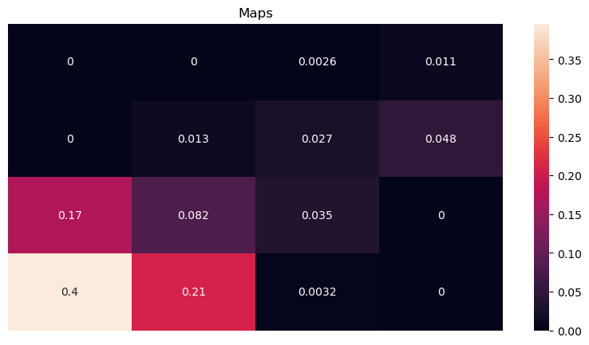
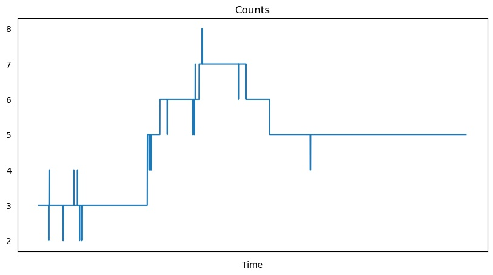

# Retail Vision Analytics

## Tracking Performance

### Results on VIRAT_S_000002 evaluated using TrackEval
| Dataset           |  MOTA | IDF1 | HOTA | MT | ML | FP | FN | IDs |VISUAL|
|-------------------|-------|------|------|-------|-------|------|------|------|------|
|ByteTrack+YOLOX    | 97.8 | 91.9 | 73.1 |   3   |   0   |   26  |   37  |   3  |PASS |


### Visualization (ByteTrack + YOLOX)
   
   

### [Analytics](https://github.com/dberwang/retail-vision-analytics/blob/main/notebooks/analytics.ipynb)
      


## Installation
Please run the below on system with GPU.
```shell
git clone https://github.com/dberwang/retail-vision-analytics
cd retail-vision-analytics
sudo docker build -t retail-vision-analytics:latest .
sudo docker run --gpus all -it --rm --privileged -p 5000:5000 retail-vision-analytics:latest
flask run -h 0.0.0.0
```
Then open your web browser: x.x.x.x:5000


## 1. Project Proposal

Millions of brick-and-mortar stores have cameras; however, most retailers only use their footage for security. Video of your customers is a data treasure trove! So why aren't retailers analyzing their video footage? Because manually reviewing videos is costly and challenging. 

To succeed in a highly competitive marketplace, retailers must know their customers. The capability to produce customer analytics would help businesses better serve their customers and gain an edge over the competition.

The primary questions that I seek to answer are:

* Can retail vision analytics be generated from video using Computer Vision? 
* Would generated analytics be reliable?
* How much would an automated process cost?

Retail Vision Analytics for retail wasn't feasible ten years ago, but it may be possible today. 

## 2. Data

The primary video data used was the Ground VIRAT Video Dataset Release 2.0. This publicly available video is similar to footage that a retailer would have of customers walking in parking lots and walking areas outside of its stores. The camera views are from various fixed locations, outdoors and during daylight hours.

The VIRAT videos include annotations for known objects in each frame. I planned to use these annotations to fine-tune the pre-trained models and evaluate performance. The format of the VIRAT annotations differed from YOLO and required converting before generating IOU metrics. Also, I discovered discrepancies while visually reviewing the annotation data that included some sloppy fits and missing detections. Consequentially, I manually annotated one of the VIRAT videos using Roboflow to establish ground truth for evaluating the model. Due to time and resource limitations for annotating the video, a manual visual review assessed the model's results of an unannotated video.

## 3. Models

Our prototype app must do the following:

* Detect and locate persons in the video
* Assign each detected person a unique id and track them through the video
* Generate analytics 

## 3.1 DeepSORT with YOLOv7

My first solution was to use DeepSORT for tracking and run You-Only-Look-Once v7 (YOLOv7) for detection. DeepSORT extends the Simple Online and Realtime Tracking (SORT) to integrate appearance information based on a deep appearance descriptor. YOLOv7 is a state-of-the-art object detection algorithm that uses a convolutional neural network (CNN) trained on the MS COCO dataset. 

Unfortunately, DeepSORT had too many ID switches and frequently performed poorly with occlusions involving groups of people. The HOTA score was 43.4 and there were 54 id switches during a 30 second period. 

## 3.2 ByteTrack with YOLOX

My second attempt was to run ByteTrack and YOLOX. ByteTrack uses an association method that does not discard low-score boxes and employs tracklets to recover actual objects and filter out background detections. The ByteTrack repository comes pre-trained model and uses YOLOX for detection.

ByteTrack had extremely few ID switches in the test video despite numerous occlusions and shady regions.  

## 4. The Prototype


The Flask web app prototype was deployed on an Ubuntu 20.04 server and successfully tested on a Tesla V100 machine with 30 Gib RAM and 8 CPUs. GitHub is used for version control and includes a dockerfile for easy cloud deployment. 

Users can access the app through a web browser and upload their videos. The app then analyzes the video, converts it to a web-compatible format, generates a results file, and runs analytics using a Jupyter notebook. The notebook includes analytics such as customer maps, timelines, and counts. After processing, a results page allows users to view or download the video and data.

Below are the results of a time study conducted on a 5-minute video, 641 MB, and 30 FPS. 

* Analyze video: 20 minutes
* Convert video: 5 minutes
* Run the analytics: 10 seconds

The total processing time is five times the duration of the video. If the app eliminated video conversion, the processing time would decrease by 20%. However, 12 hours of store video would still take two days to process. 

Operationalized versions of this product should be faster to meet customer needs. Quicker processing is possible by splitting and running distinct video sections on multiple GPUs. For example, for a roughly 5x improvement, we combine the results of 5 GPUs that uniquely run 20% of the video. Enhancements that reduce costs should also be investigated, such as frame skipping and algorithm optimization.  

## 5. Conclusions

This project showcases the reliability of an automated process for analyzing videos utilizing current algorithms in Computer Vision. The metrics and visual inspection results indicate that the tracking performance is on par with human tracking.

Two benefits of Computer Vision are its immunity to mental fatigue and the efficient tracking of large groups of individuals. While the algorithm may encounter errors during complex occlusions or instances where a person is close to objects resembling humans, these scenarios can also prove challenging for human observers.

In terms of cost, the cloud-based analysis of video footage is approximately $10 per hour. This cost assumes processing to be four times the video's duration and GPU costs of $2.50 per hour on a Tesla V100. Processing 12 hours of footage would cost $120 per day, comparable to minimum wage. There is potential for further improvements to be made to the existing app to reduce these costs, and advancements in CV algorithms will reduce costs even further.

The tracking data generated by our app creates valuable analytics for retailers. For example, it can provide insight into how long customers spend in specific regions of a store, which products they show the most interest in, and how they flow through the store. Retailers can use this information to optimize store layouts, create targeted marketing campaigns and enhance the overall shopping experience for customers.
